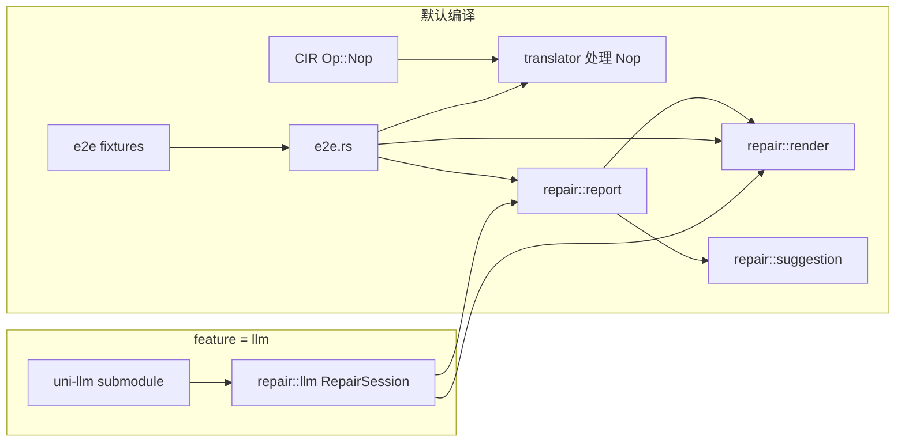

# 端到端验证测试 + 反例驱动修复

## 现状

- **CVN analysis** 已有：BFS/DFS 状态空间搜索、死锁检测、反例 trace 生成（`cvn/src/analysis/`）
- **cir2cvn 翻译器** 已有：完整 CIR -> CVN 翻译，含所有资源类型支持
- **缺失**：CIR `Op::Nop` 支持、反例报告格式化、LLM 修复 prompt 生成、端到端测试、LLM 访问基础设施
- CVN 的 `PropertyViolation::Liveness` / `SignalLoss` 仅类型占位，无实现（本轮不涉及）

## 零、uni-llm submodule 集成

### 添加 submodule

```bash
git submodule add https://github.com/kevindadi/uni-llm.git uni-llm
```

产生的 `.gitmodules`（追加一项）：

```ini
[submodule "uni-llm"]
	path = uni-llm
	url = https://github.com/kevindadi/uni-llm.git
```

### Cargo.toml 变更

在 [Cargo.toml](Cargo.toml) 中将 `uni-llm` 作为 **optional 依赖** 并引入 `llm` feature：

```toml
[features]
default = []
llm = ["dep:uni-llm", "dep:tokio"]

[dependencies]
# ... 原有依赖 ...
uni-llm = { path = "./uni-llm", optional = true }
tokio = { version = "1", features = ["full"], optional = true }
```

- 默认编译不含 `llm` feature -> 不需要网络、不需要 API key
- `cargo build --features llm` 时才编译 LLM 调用代码
- `cargo test` 默认不触发 LLM 相关代码

### repair::llm 模块（feature-gated）

在 `src/repair/llm.rs` 中，用 `#[cfg(feature = "llm")]` 门控：

```rust
#[cfg(feature = "llm")]
pub struct RepairSession {
    client: uni_llm::UniLlmClient,
    max_rounds: usize,
}

#[cfg(feature = "llm")]
impl RepairSession {
    pub async fn new(config_path: &str, max_rounds: usize) -> Result<Self, ...> { ... }

    /// 完整修复闭环：buggy CIR -> 检测 -> prompt LLM -> 拿回 fixed CIR -> 再验证
    pub async fn repair_loop(
        &self,
        buggy_cir: &cir::ast::Program,
    ) -> Result<RepairResult, ...> { ... }
}
```

本轮实现：写好 struct 和方法签名 + TODO 注释，**不需要 API key 即可编译通过**。实际 LLM 调用逻辑后续填充。

## CIR JSON 格式修正

用户 spec 中的 JSON 与实际 CIR 格式有几处差异，创建 fixture 时需修正：

- **resources 必须有 `"kind"` 字段**：Mutex/RwLock/Semaphore/Channel 用 `"sync"`，Var/Atomic 用 `"var"`
- **branch 条件是字符串**，不是数组：`"ready == true"` 而非 `["ready", "==", true]`
- **CAS args 是字符串**：`"false"`, `"true"` 而非 `false`, `true`
- `**"nop"` op CIR 不支持，需先添加（仅 test 8 fixed 用到，本轮 scope 外，但最好现在加上）

## 一、CIR 新增 Op::Nop

在 [cir/src/ast.rs](cir/src/ast.rs) 中：

- `Op` 枚举添加 `Nop` 变体
- 序列化为 `"nop"` 字符串
- 反序列化时 `visit_str` 匹配 `"nop"` -> `Op::Nop`
- 翻译器 [src/translator/operation.rs](src/translator/operation.rs) 需处理 `Op::Nop` -> `TransitionKind::Sequential`

## 二、反例报告模块 (`src/repair/`)

```
src/repair/
  mod.rs          -- pub mod + pub use + 顶层 analyze() 函数
  report.rs       -- BugKind, BugReport, DeadlockParticipant, EnrichedFiringStep
  render.rs       -- BugReport -> 文本报告 + LLM 修复 prompt
  suggestion.rs   -- BugKind -> 模板化修复建议字符串
```

### report.rs 数据结构

```rust
pub enum BugKind {
    Deadlock { participants: Vec<DeadlockParticipant> },
    SignalLoss { notifier_tid: String, waiter_tid: String },
    ChannelBlock { blocked_op: String, channel: String },
}

pub struct DeadlockParticipant {
    pub function: String,
    pub blocked_at_sid: String,
    pub holding: Vec<String>,
    pub waiting_for: String,
}

pub struct EnrichedFiringStep {
    pub transition_id: String,
    pub kind: TransitionKind,
    pub anchor_sids: Vec<String>,
    pub description: String,
}

pub struct BugReport {
    pub kind: BugKind,
    pub trace: Vec<EnrichedFiringStep>,
    pub final_marking_summary: String,
    pub summary: String,
    pub involved_resources: Vec<String>,
    pub involved_functions: Vec<String>,
}
```

### 分析逻辑 (`mod.rs` 中的 `analyze()`)

```rust
pub fn analyze(
    program: &cir::ast::Program,
    net: &CvnNet,
    result: &AnalysisResult,
) -> Vec<BugReport>
```

对每个 CVN `Counterexample`：

1. **分类 BugKind**：

- 如果 `final_state` 中有 wait place 有 token -> `SignalLoss`（waiter 被阻塞在 condvar wait）
- 否则 -> `Deadlock`

1. **Deadlock 参与者分析**：

- 调用 `blocked_places(net, &cx.final_state)` 获取被阻塞的 control places
- 对每个 blocked place，查找其所属函数（从 `PlaceKind::Control { fn_name, sid }`）
- 查找该 place 的出边 transitions，获取其输入弧中的 resource places
- resource place 无 token -> 该函数在等待此资源
- 反向查找：哪些函数的 control place 有 token 且该函数曾消耗过该 resource（resource place 的 token 在谁手上）

1. **Trace 丰富**：遍历 CVN `FiringStep`，添加 `TransitionKind`、`anchor_sids`、人类描述

### render.rs 输出格式

```
BUG: Deadlock detected

TRACE (6 steps):
  1. [main.s1] spawn(w1)
  ...

DEADLOCK:
  w1: 持有 [mtx_a], 等待 mtx_b (blocked at w1.s2)
  ...

SUGGESTION: ...
```

LLM 修复 prompt 模板按用户 spec 第十一节的格式组装。

### suggestion.rs

按 `BugKind` 返回模板化修复建议（已在 spec 中定义）。

## 三、端到端测试

### 目录结构

```
tests/e2e/
  mutex_deadlock/      buggy.json, fixed.json, expected_bug.json
  signal_loss/         buggy.json, fixed.json, expected_bug.json
  channel_deadlock/    buggy.json, fixed.json, expected_bug.json
  three_way_deadlock/  buggy.json, fixed.json, expected_bug.json
  semaphore_throttle/  buggy.json (no bug)
  cas_race/            buggy.json (no bug)
```

### expected_bug.json 格式

```json
{
  "kind": "Deadlock",
  "involved_resources": ["mtx_a", "mtx_b"],
  "involved_functions": ["w1", "w2"]
}
```

### 测试流程（`tests/e2e.rs`）

```rust
fn run_e2e(dir: &str) {
    let buggy = load_cir(&format!("tests/e2e/{dir}/buggy.json"));
    let net = cir2cvn::translate(&buggy).unwrap();
    let result = cvn::analysis::explore(&net, &AnalysisConfig::default()).unwrap();

    if let Some(expected_path) = find("expected_bug.json") {
        let expected: ExpectedBug = load(expected_path);
        let reports = cir2cvn::repair::analyze(&buggy, &net, &result);
        assert!(!reports.is_empty());
        assert_eq!(reports[0].kind_name(), expected.kind);
        // 断言涉及的资源和函数
        // 验证文本渲染不为空
    }

    if let Some(fixed_path) = find("fixed.json") {
        let fixed = load_cir(fixed_path);
        let fixed_net = cir2cvn::translate(&fixed).unwrap();
        let fixed_result = explore(&fixed_net, &config).unwrap();
        assert!(fixed_result.deadlocks.is_empty());
    }
}
```

### 6 个测试用例

| #   | 目录名               | BugKind    | buggy/fixed   |
| --- | -------------------- | ---------- | ------------- |
| 1   | `mutex_deadlock`     | Deadlock   | buggy + fixed |
| 2   | `signal_loss`        | SignalLoss | buggy + fixed |
| 3   | `channel_deadlock`   | Deadlock   | buggy + fixed |
| 4   | `three_way_deadlock` | Deadlock   | buggy + fixed |
| 5   | `semaphore_throttle` | (none)     | buggy only    |
| 6   | `cas_race`           | (none)     | buggy only    |

## 四、公共 API 扩展

在 [src/lib.rs](src/lib.rs) 中暴露 `pub mod repair`。

## 依赖关系



- `repair::report` / `render` / `suggestion`：纯同步代码，默认编译
- `repair::llm`：`#[cfg(feature = "llm")]`，依赖 uni-llm + tokio，需显式启用
- 端到端测试：只测 report/render，不测 LLM 调用
