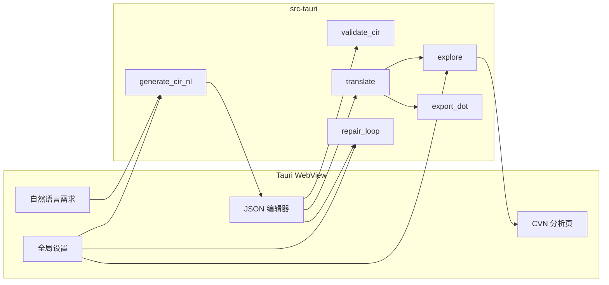

# Tauri 桌面端：NL→CIR + 可配置 LLM + 独立 CVN 分析

## 现状与缺口

- 核心能力已在库中：[translate](src/lib.rs)、[`ceir::validate`](cir/src/main.rs) 同逻辑、[`cvn::analysis::explore`](cvn/src/analysis/search.rs)（`AnalysisConfig`：BFS/DFS、`max_states`）、[`cvn::export::to_dot`](cvn/src/export.rs)、可选 [`RepairSession`](src/repair/llm.rs)（`llm` feature，`uni-llm` TOML）。
- **自然语言 → CIR**：仓库内目前主要在 [`experiments/run_experiment.py`](experiments/run_experiment.py)（RQ1 为 **Rust 源码**）；你选择了 **NL → CIR**，需要在 **Rust 侧新增**「生成 system prompt + 多轮对话 + `ceir::validate` 反馈」闭环（与 Python 里 RQ1 结构类似，但 user 内容为需求文档而非 `rust`）。
- 主包 [`Cargo.toml`](Cargo.toml) 无 `[[bin]]`，适合新增 **workspace 成员**承载 Tauri 二进制，而不是把 GUI 硬塞进 `cir2cvn` 库。

## 架构（建议）

- **敏感配置**：`uni-llm` 的 `api_key_env` 等仍走 TOML/环境变量；前端只传「配置文件路径」或应用数据目录下的相对路径，**不把 key 明文存进 localStorage**。
- **可配置项（建议一份 JSON Schema，存应用数据目录）**：
  - LLM：`uni-llm.toml` 路径；可选运行时覆盖 `provider` / `model` / `temperature` / `max_tokens` / `timeout`（[`UniLlmClient::with_model` 等](uni-llm/src/client.rs) 已支持链式覆盖）。
  - 生成：最大轮次、**可编辑的 system prompt**（默认用 `include_str!` 内置 NL 版，设置里可覆盖为自定义文本）。
  - 分析：`SearchStrategy`、`max_states`。
  - 修复：`max_rounds`（[`RepairSession`](src/repair/llm.rs)）。

## 实现步骤

### 1. Workspace 与 Tauri 壳

- 根 [`Cargo.toml`](Cargo.toml) 改为 `[workspace]`，`members` 包含现有包名与新建 `cpn-gui`（名称可议）。
- 用 Tauri 2 官方流程在 `cpn-gui/` 初始化（推荐 **React + TypeScript + Vite**，与模板一致；若你更熟 Svelte 可替换前端脚手架，Rust 侧不变）。
- `cpn-gui/src-tauri/Cargo.toml`：`cir2cvn = { path = "..", features = ["llm"] }`，`tauri` + `serde` + `tokio`；按需 `tauri-plugin-store` 或直接用 `tauri::api::path::app_data_dir` + `std::fs` 读写 `app_settings.json`。

### 2. 在 `cir2cvn` 中增加 NL 生成（`llm` feature）

- 新文件例如 [`src/generation_nl.rs`](src/lib.rs)（并在 `lib.rs` 中 `#[cfg(feature = "llm")] pub mod generation_nl`）。
- 职责：`async fn generate_cir_from_requirements(client: &UniLlmClient, user_requirements: &str, system_prompt: &str, max_rounds: usize) -> Result<String, GenerationError>`：
  - 首轮：`Message::system` + `Message::user`（附需求文本）。
  - 从回复中抽取 JSON（可复用 [`extract_json_from_response`](src/repair/llm.rs) 或抽到 `repair` 公共小工具）。
  - `serde_json::from_str` → `ceir::validate::validate`；若无效，把 **诊断列表** 拼进下一轮 user（与 Python RQ1 纠错循环一致）。
- **Prompt**：新建 `src/generation_nl_prompt.md`（与 [`cir_schema_prompt.md`](src/repair/cir_schema_prompt.md) 区分：前者修 bug，后者描述完整 CIR schema；NL 版强调「仅根据需求抽象并发模型」，并引用与论文一致的 JSON schema 要点）。
- 单元测试：用 `mock` 较难；至少对「纯 JSON 解析 + validate 错误拼接」做同步测试；集成测试可 `#[ignore]` + 需 key。

### 3. Tauri `invoke` 命令（Rust）

建议命令粒度（名称可微调）：

| 命令              | 输入                                                               | 输出                                                                                                                            |
| ----------------- | ------------------------------------------------------------------ | ------------------------------------------------------------------------------------------------------------------------------- |
| `validate_cir`    | CIR JSON 字符串                                                    | `ValidationReport`（已有 serde）                                                                                                |
| `translate_cir`   | CIR JSON                                                           | 成功：`cvn_dot` 字符串 + `translate_warnings`；失败：结构化 `TranslateError` 列表                                               |
| `analyze_cvn`     | CIR JSON + `AnalysisConfigDTO`                                     | `state_count`、`deadlocks`（序列化 [`Counterexample`](cvn/src/analysis/counterexample.rs) 摘要）、`explore_error`（如状态爆炸） |
| `repair_cir`      | CIR JSON + `max_rounds` + 可选 config 路径覆盖                     | `RepairOutcome` 摘要 + JSON                                                                                                     |
| `generate_cir_nl` | 需求文本 + 可选 `system_prompt_override` + `max_rounds` + LLM 覆盖 | 最终 CIR JSON 字符串 + 每轮元数据（可选）                                                                                       |

长耗时命令用 **`tokio::spawn` + channel / Tauri event** 向前端推送进度（第 N 轮、校验错误条数），避免阻塞 UI。

### 4. 前端界面（页面划分）

- **工作台**：多行文本「需求」、按钮「生成 CIR」、Monaco/CodeMirror 展示/编辑 JSON、按钮「校验」「导出文件」；侧边可展示最近诊断列表（来自 `validate_cir`）。
- **CVN 分析**（独立路由）：载入当前 CIR（或从工作台同步）、配置 BFS/DFS 与 `max_states`、执行「翻译 + 分析」；展示状态数、死锁/反例列表；**CVN 结构图**：后端返回 `to_dot` 字符串，前端用 **WASM Graphviz**（如 `@hpcc-js/wasm`）或「下载 `.dot`」兜底。
- **设置**：`uni-llm.toml` 路径选择、默认 provider/model/temperature、各子流程 max 轮次、NL system prompt 文本域、分析默认参数；导入/导出完整配置 JSON。

### 5. 质量与发布

- `cargo clippy` / `cargo test`（workspace）。
- 前端 `pnpm lint` + `typecheck`。
- 文档：在根 [`README.md`](README.md) 增加一节「桌面端」：构建命令、`uni-llm.toml` 示例路径、macOS 公证若需要可后续再做。

## 风险与对策

- **NL 生成 CIR 质量**强依赖 prompt；计划内提供 **可编辑默认 prompt** 与多轮校验反馈，便于你迭代论文实验。
- **大图 DOT**：大图 WASM 渲染可能卡；分析页提供「仅统计 + 文本反例」与「可选渲染」开关（写入配置）。

## 主要涉及文件

- 根：[`Cargo.toml`](Cargo.toml)（workspace）
- 库：[`src/lib.rs`](src/lib.rs)、新建 `src/generation_nl.rs`、`src/generation_nl_prompt.md`；酌情从 `repair/llm.rs` 抽出 `extract_json` 公共函数
- 新目录：`cpn-gui/src-tauri/*`、`cpn-gui/src/*`
